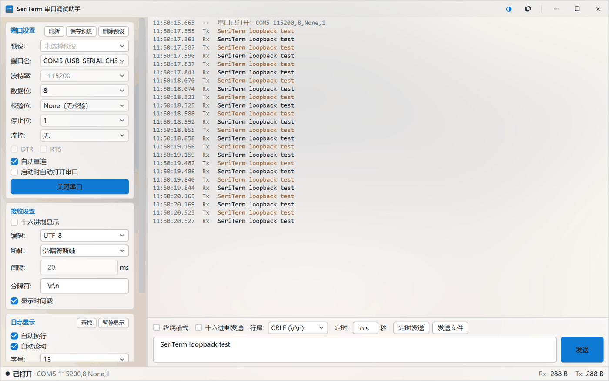
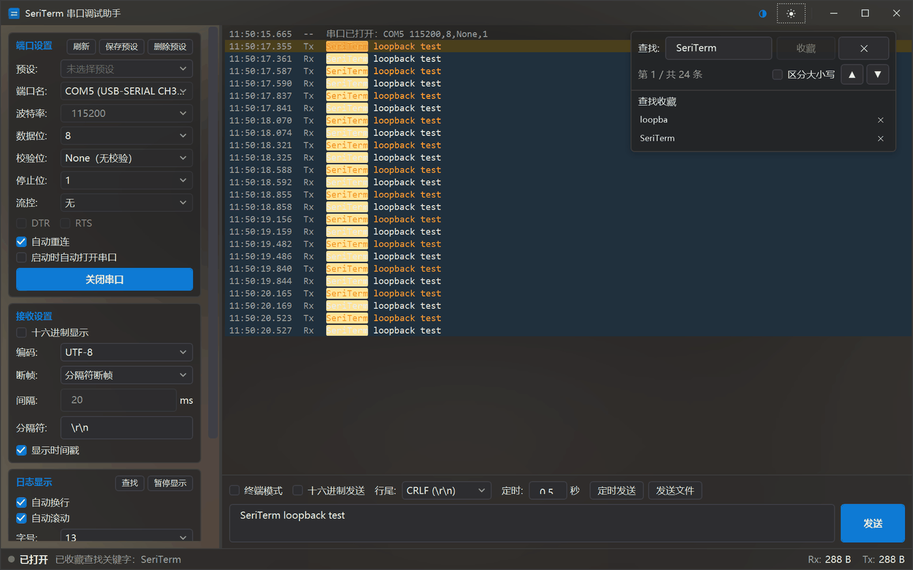
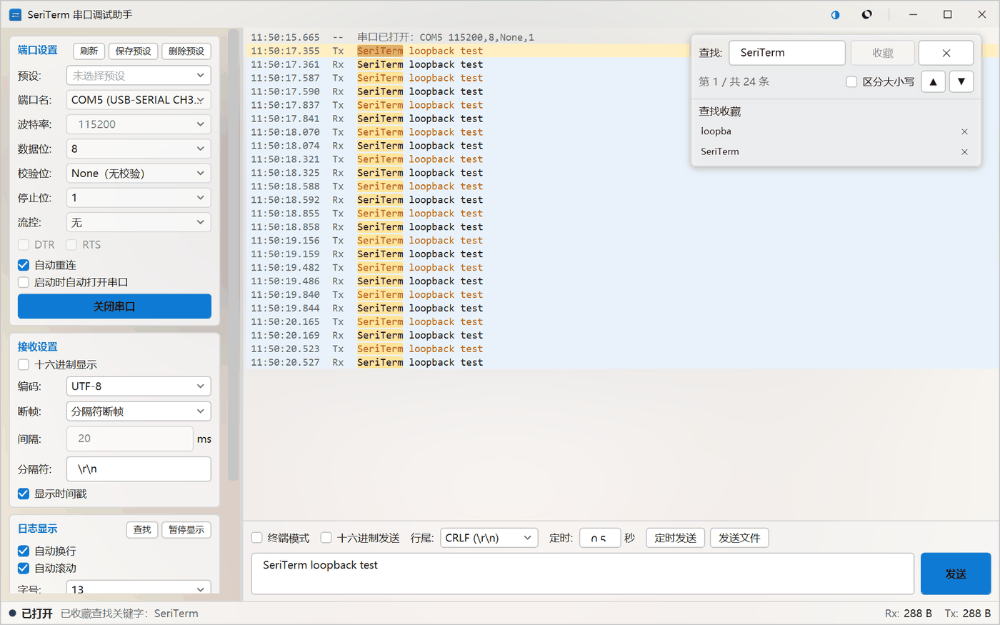

# SeriTerm

[](https://github.com/newMalloc/SeriTerm/actions/workflows/ci.yml)
[](https://github.com/newMalloc/SeriTerm/releases)
[](LICENSE)

[English](README.en.md) | **简体中文**

Windows 串口调试助手（C# / WPF / .NET 8）。面向嵌入式、单片机和硬件调试里"看数据、发命令、抓日志"这三件日常事，
复刻 [lingguang「串口调试助手」](https://lgblog.github.io/Help/zh-Hans/) 的核心串口能力，并在长时间抓取、大数据量显示、
故障提示这几处做了更稳的实现。

- **下载即用**：到 [Releases](https://github.com/newMalloc/SeriTerm/releases) 拿单文件绿色版（win-x64，免安装 .NET 运行时）；
- **逻辑与界面分离**：接收管线、断帧、编解码、日志落盘、重连策略都在无 WPF 依赖的 `SeriTerm.Core` 里，可完整单测；
- **长时间接收不卡顿**：虚拟化日志视图 + 批量刷新，显示行上限 20 万，超出按段淘汰最旧。

文档：[开发规格与里程碑](docs/development-plan.md) · [验证记录（实测证据）](docs/verification.md)

## 界面

| 浅色主题 | 深色主题 |
|---|---|
|  |  |

查找与收藏浮层——叠在日志右上角，不占日志行高，命中的字符被逐字高亮：



## 功能特性

### 连接与参数

- 端口枚举带**设备友好名**（如 `USB-SERIAL CH340`），不必靠猜哪个 COM 口是自己要的；
- 波特率 / 数据位 / 校验 / 停止位 / 流控配置，**配置预设**可命名保存、一键套用；
- 打开 / 关闭串口，Rx / Tx 字节计数实时显示；
- 启动时可自动打开上次使用的端口；
- **自动重连**：拔线不再误报"被其它程序占用"，插回后按指数退避自动恢复。

### 接收与显示

- 虚拟化日志视图，长时间接收不卡顿；显示行上限 20 万，超出按段淘汰最久的数据；
- **文本 / HEX 双模式**，切换时已有行整屏重刷；多编码支持（GB2312、UTF-8 等），跨块解码不乱码；
- **断帧策略**：空闲间隔 / 分隔符（CRLF 等）/ 不断帧，带缓冲区上限保护，避免粘包或半包显示；
- 时间戳列开关、自动换行、字号调节；
- **自动滚动智能开关**：向上翻阅时自动暂停，底部出现"▸ N 条新数据"提示条，回到底部自动恢复；
- 暂停显示（新数据仍继续进入缓冲区）、清空、保存。

### 查找、选择与复制

- `Ctrl+F` **实时搜索**：命中计数"第 N / 共 M 条"、上下跳转、命中的**字符级高亮**（当前命中与普通命中深浅不同）；
- 关键字可**收藏**，以浮层形式叠在日志右上角，点一下即回填搜索框并跳到第一处命中，逐条删除；
- 日志可**自由选中任意一段文字再复制**：行内、跨行都按字符选——第 1 行的后半段 + 中间整行 + 最后一行的前半段
  可以一次选中，`Ctrl+C` / 右键「复制」拿到的就是屏幕上高亮的那一段（时间戳与方向列也在选择范围内）；
  点一下整行仍是"选中整行"（整行复制这个粒度保留）。

### 发送

- 文本 / HEX 发送，行尾可选（CR / LF / CRLF）；
- **定时发送**：设定间隔后自动重发；
- **文件分块发送**：可取消、带进度。

### 终端模式

- 逐键即发、回车 / 退格 / `Ctrl+C` 透传、本地回显、多行粘贴、ANSI 转义过滤。

### 日志落盘

- 文本日志 + **原始字节日志**（可重放回日志区），按大小分卷；
- 后台异步写队列，落盘不阻塞接收；
- 日志目录可配置；另有只在出错时才写的诊断日志，便于排查发布版问题。

### 界面

- 深 / 浅两套主题，运行中即时切换；
- 自绘标题栏（跟随主题）+ 窗口背景模糊（可关闭）；
- 标题栏右上角「关于」（或按 <kbd>F1</kbd>）：版本号、提交号、运行时、许可，以及 GitHub 仓库 / 发布版下载入口；
  对话框是纯色窗口（不受主窗口"模糊背景"的半透明表面影响）。

## 环境要求

- Windows 10 1809 或更高（WPF，目标框架 `net8.0-windows`）；
- 从源码构建需要 .NET SDK 8.0 或更高；
- 使用已发布的单文件绿色版则无需安装 .NET 运行时。

## 构建与运行

```powershell
dotnet build SeriTerm.sln
dotnet run --project src/SeriTerm.App
```

## 测试

```powershell
dotnet test SeriTerm.sln
```

- 绝大多数测试是**纯逻辑单测**（断帧边界、编解码、搜索、发送组装、日志落盘与重放、重连退避、故障归类、配置预设等），不需要任何硬件；
- 另有一组**回环集成测试**，需要把一个 USB-TTL 的 **TX 与 RX 短接**。默认使用 `COM5`，换端口不必改源码：

  ```powershell
  $env:SERITERM_LOOPBACK_PORT = 'COM3'
  dotnet test SeriTerm.sln
  ```

- 目标端口不存在时（CI runner，或没插 USB-TTL 的机器），这组测试会被 `LoopbackFactAttribute` 标记为 **skipped** 而不是 failed，
  所以 `dotnet test` 同样全绿；有回环硬件时是 **286 通过 / 0 失败**（280 单测 + 6 回环）；
- 串口是独占资源，测试程序集已禁用并行执行。

### 持续集成

[`.github/workflows/ci.yml`](.github/workflows/ci.yml) 在 `windows-latest` 上依次执行
`dotnet restore` → `dotnet build -c Release` → `dotnet test -c Release`，并把 trx 报告作为构建产物上传。

- App 是 WPF（`net8.0-windows`），runner 必须是 Windows，`ubuntu-latest` 编译不过；
- runner 上没有任何串口，回环测试整组 skipped，因此公开 CI 恒为绿；有短接回环硬件的机器上跑同一套命令是
  **286 通过 / 0 失败**（280 单测 + 6 回环）。

## 目录结构

```
SeriTerm.sln
Directory.Build.props            # 全解决方案编译约定
.github/workflows/ci.yml         # 持续集成：构建 + 测试
docs/development-plan.md         # 开发规格：范围、模块、里程碑、设计决策与实现记录
docs/verification.md             # 验证记录：自动化测试与回环验证的实测数字
tools/                           # 开发与验证脚本（发布、图标、截图、探针、UI 冒烟）
src/
  SeriTerm.Core/                 # 纯逻辑层，零 WPF 依赖，可单测
    Serial/                      # 参数模型、传输实现、端口枚举、错误翻译、重连策略与监督者
    Framing/                     # 断帧策略（空闲间隔 / 分隔符）
    Text/                        # HEX 编解码、有状态文本解码、字节模式转义、ANSI 过滤
    Terminal/                    # 终端模式按键编码
    Send/                        # 发送组装、定时发送器、文件分块发送
    Logging/                     # 日志落盘（文本 + 原始字节）、后台写队列、原始日志读取
    Presets/                     # 配置预设模型（增删改与默认命名）
    Pipeline/                    # 接收处理器、显示行、接收选项
    Documents/                   # 日志文档（存储 / 淘汰 / 搜索）与批量通知集合
  SeriTerm.App/                  # WPF 表现层
    Assets/                      # 应用图标（设计稿 PNG + 由它生成的 ICO）
    MainWindow.xaml              # 主窗口：自绘标题栏 + 左设置 / 右日志发送
    AboutWindow.xaml             # 「关于」窗口（版本、提交、运行时、GitHub 链接）
    Services/                    # 主题、配置存储、用户提示、设备友好名、文件对话框、输入法控制、版本信息
    ViewModels/                  # MainViewModel 等
    Controls/                    # LogView：虚拟化日志 + 自动滚动 + 查找浮层
    Themes/                      # Shared.xaml + Dark.xaml + Light.xaml
  SeriTerm.Tests/                # xUnit：纯逻辑单测 + 回环集成测试
```

## 关键设计约束

这几条是这类工具"不丢数据、不卡死"的前提，改动时请勿违反：

1. **不使用 `SerialPort.DataReceived` 事件**：它在线程池上触发、会丢事件，高波特率必丢数据。传输层用专用后台线程做阻塞读。
2. **读取使用有限超时（100 ms）+ 取消标志轮询**：`SerialPort` 的取消令牌无法可靠中断已阻塞的读，`Close()` 可能永久挂住。
3. **读取线程绝不碰 UI**：只做计数与入队，界面侧约 30 fps 批量刷新。
4. **一批日志只发一次集合通知**：逐行通知会让 WPF 每行跑一次布局；淘汰旧行用整段重建，不用 `RemoveAt(0)` 循环（20 万行规模下是 O(n²)）。
5. **主题全部走 `DynamicResource`**：切换深 / 浅色无需重启。
6. **串口故障先问"端口还在不在"，再决定提示什么**：设备被拔出与"被别的程序占用"都是 Win32 `ERROR_ACCESS_DENIED`，
   只看异常类型必然误判。归类入口是 `SerialErrorTranslator.Classify(ex, portPresent)`，`portPresent` 必须由调用方在故障当下查询。
7. **"默认开启"的开关不能只靠属性变更通知去驱动其它组件**：`[ObservableProperty]` 在值未变化时不触发通知，
   "默认 true + 配置也是 true"会让功能静默失效（自动重连真踩过，见开发规格 11.17）。
8. **窗口自绘标题栏与背景模糊是绑在一起的**：`WindowStyle=None` + `WindowChrome`（`CaptionHeight` 必须等于标题栏实际高度），
   三个窗口按钮放在 `LastChildFill="False"` 的 `DockPanel` 里；`App.OnExit` 必须 `DisposeAsync` 容器，
   `OnDispatcherUnhandledException` 里不能再去解析服务（两者都是 11.22 的成因）。
9. **一个控件只在一个地方出现**：外观开关（模糊背景 / 主题）只放在标题栏，连接参数只在左栏，
   日志的常驻设置（显示设置、保存 / 清空）只在左栏「日志显示」一节；
   而**临时性的查找界面（查找框 + 收藏栏）不占版面，叠在日志右上角**——它是打开查找才出现的浮层，
   让它长期占掉日志的一行高度不划算；入口（「查找」按钮）仍留在左栏（见开发规格 11.29）。
   同一个开关在界面上有两份（原来"自动滚动"在工具栏和侧栏各一个）改起来看着省事，实际会让人不敢确定以哪个为准。
10. **两栏的信息架构分工固定**：左栏是"连接、接收、日志设置"，右栏是"日志 + 发送"。
    `发送` 是使用频率最高的按钮，必须固定在日志下方的发送区里，不能进滚动区（见开发规格 11.23–11.25）。
11. **日志区的选择粒度是"字符"，不是"行"**：每行的时间列 / 方向列 / 内容列各是一个只读文本框，
    行内拖动交给文本框原生处理；一旦拖到别的行（或同一行的别的列），就切换成自己画的跨行字符选择——
    在行容器里垫一层 `Canvas`，方块位置由各列文本框的 `GetRectFromCharacterIndex` 量出来。
    这样既保住了 20 万行虚拟化与 30 fps 刷新（整表换成一个富文本控件就会同时丢掉这两样），
    又能选中"第 1 行后半段 + 第 2 行前半段"（见开发规格 11.26、11.30）。
    字符下标的两个坑写在代码注释里：`GetRectFromCharacterIndex(i)` 给的是**左边缘零宽矩形**
    （字符宽度要用 `trailingEdge: true` 那次调用减出来），而 `GetCharacterIndexFromPoint` 给的是
    "光标底下那个字符"，要按字符中线换算成"光标在哪两个字符之间"。

## 发布

```powershell
# 单文件绿色版（推荐分发；目标机器无需安装 .NET 运行时）
pwsh -File tools/publish.ps1

# 精简版（需目标机安装 .NET 8/10 桌面运行时）
pwsh -File tools/publish.ps1 -FrameworkDependent
```

产物在 `artifacts/publish/`，单文件约 64 MB（自包含 + 压缩）。

正式发布的版本由 [`.github/workflows/release.yml`](.github/workflows/release.yml) 自动产出：推一个 `v*` 标签，
工作流会执行上面的发布脚本、算出 SHA256，并把 exe 挂到同名 [Release](https://github.com/newMalloc/SeriTerm/releases) 上。

> ⚠️ 不要开启 `PublishTrimmed`：WPF 不支持裁剪。
> 压缩发布（`EnableCompressionInSingleFile`）会让首次启动慢一点点，换来体积减半。

## 配置文件

- 位置：`%AppData%\SeriTerm\settings.json`（不带 BOM 的 UTF-8）
- 内容：主题、上次串口参数、显示 / 发送 / 终端设置、自动重连开关、背景模糊开关、日志目录、配置预设
- 另有一个只在出错时才会写的 `%AppData%\SeriTerm\ui-errors.log`：发布版没有控制台，
  未处理异常若没有落盘线索就只能靠猜。

## 开发脚本

`tools/` 下是开发期与验证期脚本。它们必须用 **Windows PowerShell 5.1** 运行（`UIAutomationClient` 只在 .NET Framework 里提供），
且文件要保存成**带 BOM 的 UTF-8**（否则中文控件名会被当 ANSI 读成乱码）。

| 脚本 | 用途 |
|---|---|
| `publish.ps1` | 发布单文件绿色版 |
| `make-icon.ps1` | 由 `Assets/seriterm.png` 生成多尺寸 ICO：自动裁到设备主体、按预乘 alpha 缩放，并出一张各尺寸浅/深底预览图（可复现） |
| `capture-window.ps1` | 启动应用并截图（含 DPI 感知处理） |
| `ui-review-capture.ps1` | 批量截图：浅 / 深主题 × 默认 / 加高尺寸，可回环灌数据（界面评审用） |
| `probe-layout.ps1` | 打印关键控件的真实矩形，用数字判断谁被挤出可视区 |
| `probe-log-drag.ps1` | 用真实鼠标事件在日志区拖一遍，读回 UIA 选中行数、跨行部分选择的剪贴板内容与行内选中字符（需 COM5 空闲） |
| `probe-log-search.ps1` | 灌数据 → `Ctrl+F` 搜索 → 读回命中计数与选中行数（验证字符级高亮与选中底色） |
| `probe-search-overlay.ps1` | 验证查找框 / 收藏栏叠在日志右上角：打开查找后日志列表顶边位移必须为 0 |
| `ui-layout-check.ps1` | 界面结构与交互断言（控件存在性、冗余项归零、控件归属左右栏、字号、预设、发送区边界、窄窗口） |
| `ui-smoke-test.ps1` | 冒烟：回环收发、自动滚动、`Ctrl+F` 搜索 |
| `ui-m4-smoke.ps1` | 冒烟：分隔符断帧、HEX 发送、定时发送 |
| `ui-m5-smoke.ps1` | 冒烟：终端模式（真实虚拟键注入） |
| `ui-m7-smoke.ps1` | 冒烟：日志落盘、启动自动打开串口 |
| `ui-m8-smoke.ps1` | 冒烟：配置预设套用 |
| `ui-reconnect-smoke.ps1` | 冒烟：真机拔插（故障诊断 + 无模态框 + 自动重连恢复） |

## 验证

- **296 个自动化测试**（290 纯逻辑单测 + 6 回环集成测试），`dotnet test` 全绿；
- **端到端回环验证**（UI 自动化真实鼠标 / 键盘事件，跑在发布产物本身）：断帧、定时发送、日志落盘与重放、
  终端模式、自动滚动智能开关、主题切换、标题栏与窗口模糊、退出路径、真机拔插自动重连；
- **界面信息架构断言**：控件归属、冗余项归零、字号生效、窄窗口不裁切等，全部通过。

逐条数字（控件坐标、字节数、改前改后对比）见 [docs/verification.md](docs/verification.md)。

## 已知边界

- **"被占用"与"已拔出"在 Win32 层无法直接区分**：两者都是 `ERROR_ACCESS_DENIED`。只有当端口仍出现在系统端口枚举里、
  却打不开时才提示"被其它程序占用"，其余情况按设备拔出处理。这是 Windows 串口独占模型的固有歧义。
- **背景模糊用的是桌面壁纸的模糊副本**，不是实时桌面内容：窗口只覆盖桌面一部分时，桌面图标与其它窗口不会出现在背景里；
  多显示器或"居中 / 平铺"壁纸样式下，背景与桌面的对齐是近似值。Windows 10 上 DWM 的旧版模糊接口对第三方窗口无效，
  所以在进程内自己做模糊。
- 模糊半径与蒙版透明度是固定值，不提供界面调节；不需要时可在标题栏关闭。
- **不提供「设置」对话框与「帮助」菜单**：点了没有反应的入口比没有这个入口更糟。
- 左侧设置栏在窗口较矮时需要滚动才能看到全部分组；主操作「打开串口」始终在首屏。
- **查找浮层会盖住日志右上角一小块**，这是"不占日志行高"的代价：无搜索、无收藏时它整块折叠，日志全宽可用。
- 单文件绿色版首次启动需要把内容解压到临时目录，比常规发布稍慢。

## 许可

[MIT](LICENSE)
