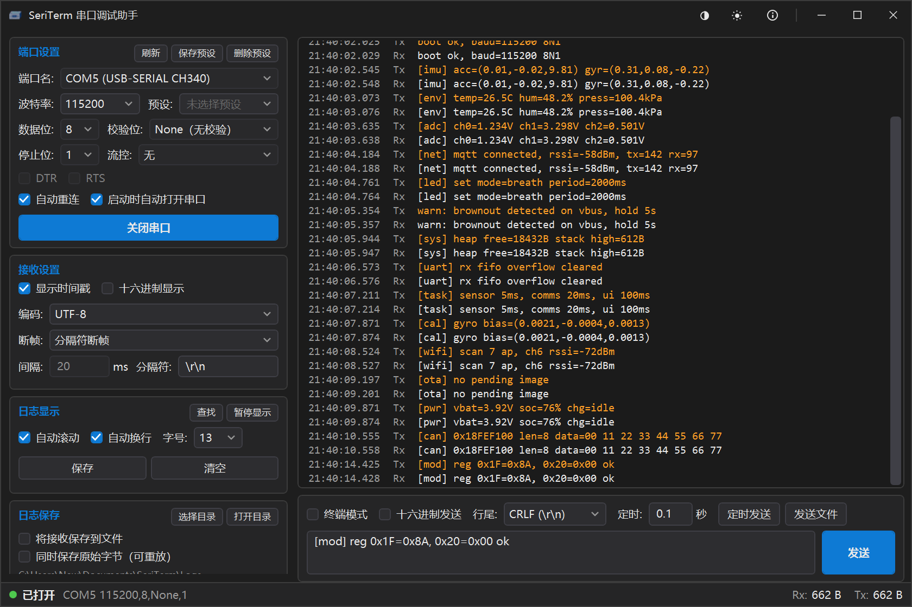

# SeriTerm

[](https://github.com/newMalloc/SeriTerm/actions/workflows/ci.yml)
[](https://github.com/newMalloc/SeriTerm/releases)
[](LICENSE)

[English](README.en.md) | **简体中文**

Windows 串口调试助手（C# / WPF / .NET 8）。看数据、发命令、抓日志三件事：
长跑不卡、20 万行不丢、断线自己接回来、单文件绿色版免安装。



## 下载

到 [Releases](https://github.com/newMalloc/SeriTerm/releases) 选一个，两个功能完全一样：

| 产物 | 大小 | 说明 |
|---|---|---|
| `SeriTerm-<版本>-win-x64.exe` | 约 3.8 MB | **推荐**。本身不含 .NET 运行时；已装 .NET 8/9/10 桌面运行时的机器只下这几 MB，没装的会在启动时先问一句，同意后自动从微软官方站点装好（约 56 MB，装一次，之后所有 .NET 程序共用）再继续启动。 |
| `SeriTerm-<版本>-win-x64-full.exe` | 约 67 MB | 运行时整套打包在 exe 内，不联网、不装任何东西，离线 / 内网分发用。 |

两个都是 win-x64 单文件，双击即用，不需要安装程序。

## 功能

**连接**

- 端口枚举带设备友好名（`COM5 (USB-SERIAL CH340)`），不用猜哪个口；
- 波特率 / 数据位 / 校验 / 停止位 / 流控，配置预设可命名保存、一键套用；
- 启动时自动打开上次的端口；**掉线自动重连**（指数退避），拔插不再误报"被其它程序占用"。

**接收**

- 文本 / HEX 双模式，多编码（UTF-8、GB2312 等）跨块解码不乱码；
- 断帧：空闲间隔 / 分隔符 / 不断帧，带缓冲区上限，不粘包也不显示半包；
- 虚拟化日志视图，显示上限 20 万行，超出按段淘汰；暂停显示、清空、保存；
- 时间戳、自动换行、字号可调；**自动滚动智能开关**——向上翻阅自动暂停，底部出现「▸ N 条新数据」。

**发送**

- 文本 / HEX，行尾 CR / LF / CRLF；
- 定时发送；文件分块发送（可取消、带进度）；
- 终端模式：逐键即发，回车 / 退格 / `Ctrl+C` 透传，本地回显。

**查找与复制**

- `Ctrl+F` 实时搜索：命中计数、上下跳转、**字符级高亮**；
- 关键字可收藏，浮层叠在日志右上角，点一下回填并跳到第一处命中；
- 日志可**按字符自由选择**：行内、跨行都行，`Ctrl+C` 拿到的就是屏幕上高亮的那一段。

**日志落盘**

- 文本日志 + **原始字节日志**（可重放回日志区），按大小分卷；
- 后台异步写队列，落盘不阻塞接收。

**界面**

- 深 / 浅两套主题，运行中即时切换；自绘标题栏；窗口背景模糊（可关闭）；
- 标题栏「关于」或 <kbd>F1</kbd>：版本号、提交号、运行时与仓库入口。

## 环境要求

Windows 10 1809 或更高（64 位）。完整版免装任何运行时；启动器需要 .NET 8 桌面运行时（缺失时会自动装好）。
从源码构建需要 .NET SDK 8.0 或更高。

## 构建与测试

```powershell
dotnet build SeriTerm.sln
dotnet run   --project src/SeriTerm.App
dotnet test  SeriTerm.sln
```

**302 个自动化测试**（294 纯逻辑单测 + 8 回环集成），`dotnet test` 常态全绿。
回环集成测试需要一根 USB-TTL 的 **TX 与 RX 短接**，默认用 `COM5`，换端口不必改源码
（`$env:SERITERM_LOOPBACK_PORT = 'COM3'`）；机器上没有回环硬件时这组自动跳过而不是失败。

## 发布

```powershell
pwsh -File tools/publish.ps1                     # 启动器，约 3.8 MB（默认，分发用）
pwsh -File tools/publish.ps1 -All                # 启动器 + 自包含完整版（约 67 MB）
pwsh -File tools/publish.ps1 -SelfContained      # 只出自包含完整版
pwsh -File tools/publish.ps1 -FrameworkDependent # 框架依赖单文件，约 1.7 MB（开发自用）
```

启动器是 [NativeAOT](https://learn.microsoft.com/dotnet/core/deploying/native-aot/) 编出来的**原生 exe**：
它自己不含 .NET 运行时，所以"机器上什么都没装"时也能双击运行；真正的程序体（框架依赖单文件）
经 Brotli 压缩后内嵌在它里面，启动时解包到 `%LocalAppData%\SeriTerm\app\<版本>\` 再跑（升级后自动清掉旧版本）。

推一个 `v*` 标签，[release.yml](.github/workflows/release.yml) 会用 `-All` 构建并把两个 exe 都挂到同名 Release 上。
Release 说明正文取自 [CHANGELOG.md](CHANGELOG.md) 里对应版本那一节，**发版前先补好**，缺了就报错不发。

## 配置

- 设置：`%AppData%\SeriTerm\settings.json`
- 诊断日志：`%AppData%\SeriTerm\ui-errors.log`（只在出错时写）

## 已知边界

- **「被占用」与「已拔出」在 Win32 层无法区分**（都是 `ERROR_ACCESS_DENIED`）：只有端口仍在系统枚举里、
  却打不开时才提示"被其它程序占用"，其余按设备拔出处理。
- **背景模糊用的是桌面壁纸的模糊副本**，不是实时桌面：窗口只盖住桌面一部分时，桌面图标与其它窗口不会出现在背景里。
- **查找浮层会盖住日志右上角一小块**，这是"不占日志行高"的代价；不搜索时它整块折叠，日志全宽可用。
- 左侧设置栏在窗口较矮时需要滚动才能看全，主操作「打开串口」始终在首屏。
- 单文件绿色版首次启动要自解压到临时目录，比常规发布稍慢一点。

## 许可

[MIT](LICENSE)

设计取舍、验证数字与开发脚本说明见 [开发规格与里程碑](docs/development-plan.md) 与
[验证记录](docs/verification.md)。
